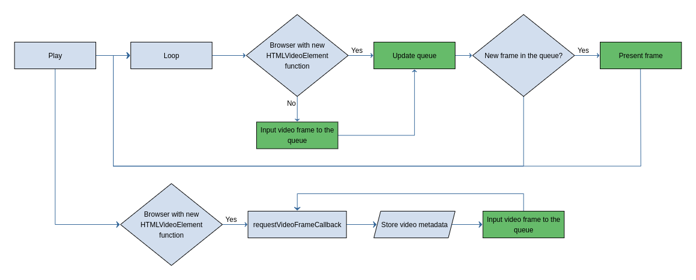

# LCEVCdec

The LCEVCdec class is constructed outside as LCEVCdec.

This class initialises all the modules and interacts with them and with the
video events.

## Experimental features

The draft function `videoFrameCallback` is used if the requestVideoFrameCallback API
is available in the browser. This allows the developer to register a callback function that runs 
when each video frame has been rendered by the browser. It also provides metadata about the video. 
This function is helpful in only inputting new frames when they are rendered.

## Main loop

Once the LCEVCdec is created it uses `requestAnimationFrame` to run a loop. In
the following diagram we can see what the loop does in the right branch:

If `videoFrameCallback` is not present in the browser, we get a new frame
from the video. Upon receiving a new frame, the queue is updated
to collect all frames whos presentation time has passed. The current
frame is kept, as it may still be on screen. The frame that has been
selected when updating the queue will be presented. Afterwards
the video controls, stats and DPS are updated.

Finally, `requestAnimationFrame` is used again to call the same function.

Not having the `videoFrameCallback` function can result in missed frames or the attempted input of
previously inputted frames. 

## Append a buffer

In order to get LCEVC data from a video, the public function `append buffer` is
used to parse the LCEVC data.

The function needs the buffer, the type of buffer, and the level/profile/quality
of this buffer.

The level is used to ensure LCEVC isn't rendered from a different level to the one being played from.

This data is sent to the demuxer worker which will then locate the LCEVC data to send on to the LCEVCdec.

## Video events

Some video events are listed in order to mimic the native player. These are:

* loadeddata:
  * Checks if the video is live.
  * Updates the controls to reflect the live video check.
  * If poster frame is enabled, render it.
* play:
  * If it is the first time, enable queue rendering.
  * Reset the presentation time in the Queue class.
  * Refresh the video control icons.
* pause:
  * Reset the presentation time in the Queue class.
  * Refresh the video control icons.
* seeked:
  * If the queue rendering is disabled, enable it to show the right frame.
  * Reset the queue.
  * If the last frame had LCEVC, clear the temporal to avoid showing wrong
    residuals.
  * If video is paused, force a new frame to be added to the queue. This is done
    because `videoFrameCallback` is asynchronous and can be called before this
    event, which would cause the queue to be reset and the temporal cleared potentially resulting in a
    new frame being missed or a black frame being shown.
* render: This is a custom event forcing the input of a frame to the queue
  and updating the display if the shader is changed or LCEVC is toggled when the video is paused.
* resizing: If paused, re-render to use the proper player size.
* timeupdate: Update our internal current time of the video.

## DPS

The dynamic performance scaling or DPS checks the amount of dropped frames, automatically
disabling the LCEVC briefly if too many frames are being lost. If the rate of dropped frames
results in the LCEVC being disabled a second time, the period of disablement will be longer. 
If triggered three times in a row the LCEVC will be permanently disabled and must be manually re-enabled.
The time spent disabled will reset to default if the DPS conditions are not triggered for a longer period of time. 

## Events

LCEVCdec triggers when there are changes at the DPS:

* PERFORMANCE_DROPPED: when the DPS is enabled.
* PERFORMANCE_RESTORED: when the DPS is disabled.
