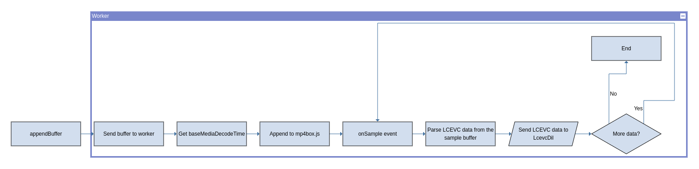

# Demuxer worker

The demuxer worker is in charge of finding LCEVC data in a buffer and send it
back to LCEVCdec.

The worker process the message from LCEVCdec and depeding the `id` value do
different things:

* `config`: Set the logging level on the worker.
* `reset`: Reset the Demuxer.
* `demux`: Process the received buffer.

## Demuxing

The message with the id `demux` holds:

* The buffer.
* Start time of the buffer.
* End time of the buffer.
* Level/profile/quality value.
* Fragment type.

This buffer is send to the Demuxer. Depending the type of
fragment it will use a different parser. For example, if a `mp4` fragment is
sent in the following diagram we can see how it is processed:

The buffer is sent to the demuxer and the header will be process to find the
`baseMediaDecodeTime`. Then, the buffer will be appened to `mp4box.js` and
for every sample it finds it will call the `onSample` function. For every
sample, the CTS and PTS will be fixed using the `baseMediaDecodeTime`. Check
if the CTS and PTS is inside the `start` and `end` time of the buffer and
find LCEVC data. If LCEVC data is found, sent it to LCEVCdec. When all the
sample are processed, the demuxer ends and wait for more messages.
