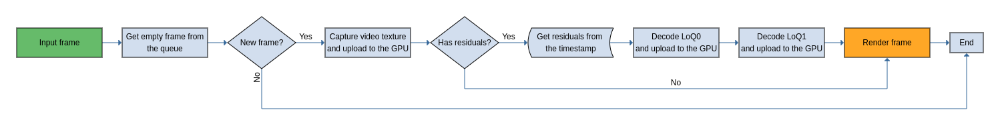
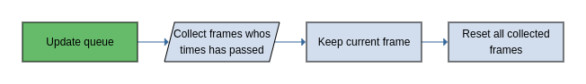
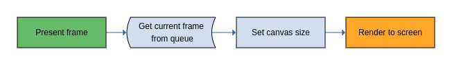

# Queue

The queue stores frames that will be render lately. Decoding frames adds an
overhead, so it is hard to decode on the fly. Using a queue it is possible
to have decode frames asynchronously while rendering.

The queue can store a static number of frames, by default is set to 10. Once
a frame is added to the queue, when it is no longer needed is reset and set
for reused. This is due to JS slow GC.

## Input frame

The `input frame` function is asynchronous. In the next diagram we can see
what it does:

First it gets an empty frame from the queue, could be a new one or one that was
reset. If the queue is full, it fails to add a new queue. If a empty frame is
got, it captures the video as a texture.

Then it tries to parse LCEVC data for the current timestamp of the video. If
LCEVC is found, it decodes the LoQ0 and LoQ1 as a texture if they are needed.
If no LCEVC is found, it skip the previous step.

Finally, the frame is render using the selected shader. This last step is
explain in depth at [the renderer document](renderer.md#PresentFrame)

## Update queue

Before presenting a frame we need to call to `update queue`. This function
is in charge of selecting the next frame of the queue that will be presented
when the `present frame` function is call and also, will reset and set for
reused the old or no longer needed frames.

In the next diagram we can see steps done by the function:

First, it iterates the frames on the queue and collects the frames whos time
has passed and store them for later reset them. For frames that are suitable
for rendering, it will select the older one and select it as the current
frame to be presented.

At the end, all those old frames are reset and set for reused.

## Present frame

Present frame gets the index of the frame of the queue that was set when
`update queue` was call, and use it for displaying it. In the following
diagram we can see what it does:

Gets the frame that is selected to be render. The canvas size is change to
match the frame size. If `renderAtDisplaySize` is
set to `true`, if the canvas size is lower than the frame size, it will use
the width of the canvas size and it will calculate the height using the
aspect ratio of the frame. This is done to reduce the GPU performance so we
don't do supersampling.

Finally, call [render to screen](renderer.md#RenderToScreen) so the Renderer
display the frame at the canvas.

This function can be call passing a frame and it will use that one instead
the one that is selected to be displayed.
