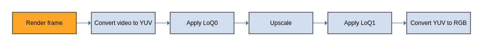
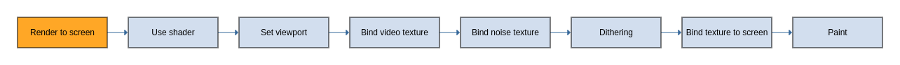

# Renderer

The Renderer class uses WebGL to render the frames using different shaders.
It then renders a frame to the screen.

## Render frame

The Queue stores the pre-rendered frames as textures so when they are displayed
most of the work is done. There are multiple ways of rendering a frame, for example: 1D 
with LCEVC, 2D with LCEVC, base only, etc. In the following diagram we
can see the steps done with 2D with LCEVC:

The video texture is converted to YUV. If there is a LoQ0 texture, we merge the
video texture with the LoQ0 texture. Then it is upscaled horizontally and upscaled vertically 
while it is merged with LoQ1.

The merged texture is converted back to RBG, so it can be displayed by
WebGL on the canvas.

The other ways of rendering a frame are generally equivalent. In order to merge
with LCEVC data, all of them have to convert the video texture to YUV, after which 
it needs to be converted back again to RGB.

## Render to screen

The frames are pre-rendered so displaying to the screen only needs a few more
steps, as shown in the next diagram:

It sets the viewport, then binds the frame texture and the noise texture. Then
it apply the dithering and this is the final texture that it used to display
the video with LCEVC data if parsed and with the dithering.
